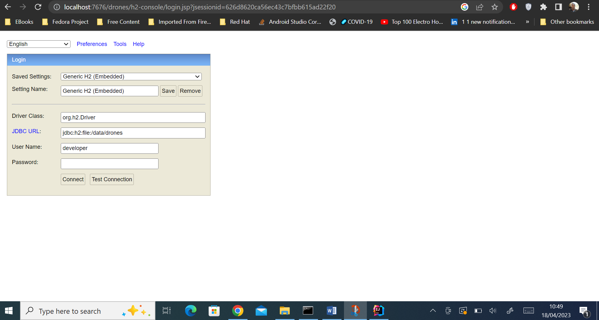
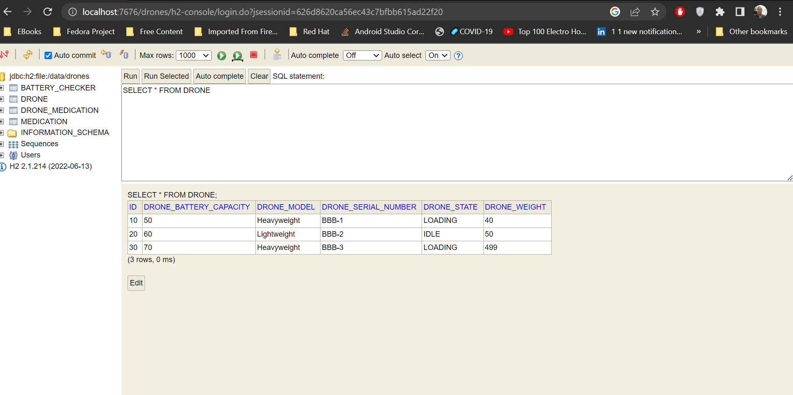
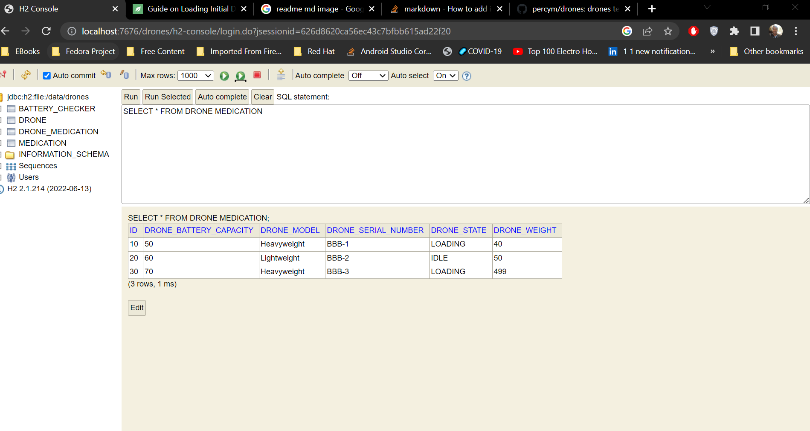
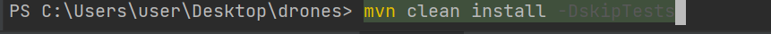
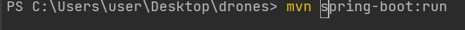
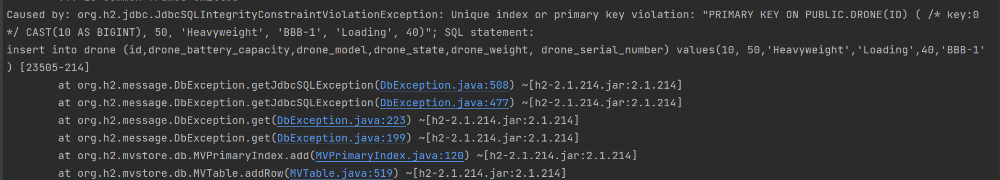
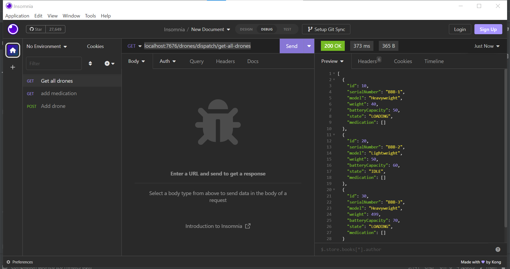

H2 Database url
http://localhost:7676/drones/h2-console/

Database is pre-populated with drone and medication data  

to download dependencies run   
mvn clean install -DskipTests

to execute app
mvn spring-boot:rum

if duplicates error shown below

delete files under
C:\data
application uses in memory db with file storage
application base url is
localhost:7676/drones/dispatch/
localhost:7676/drones/dispatch/get-all-drones

